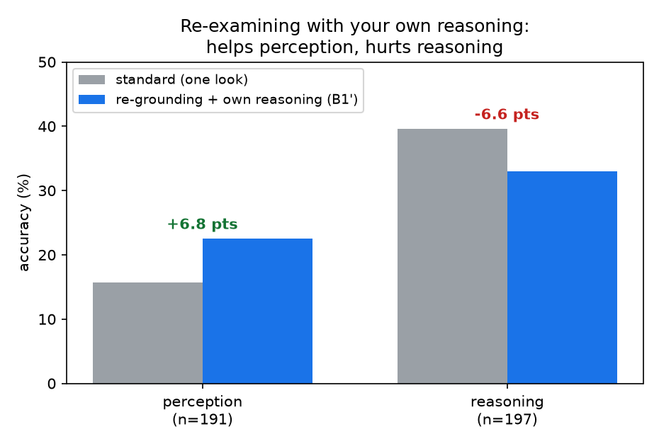
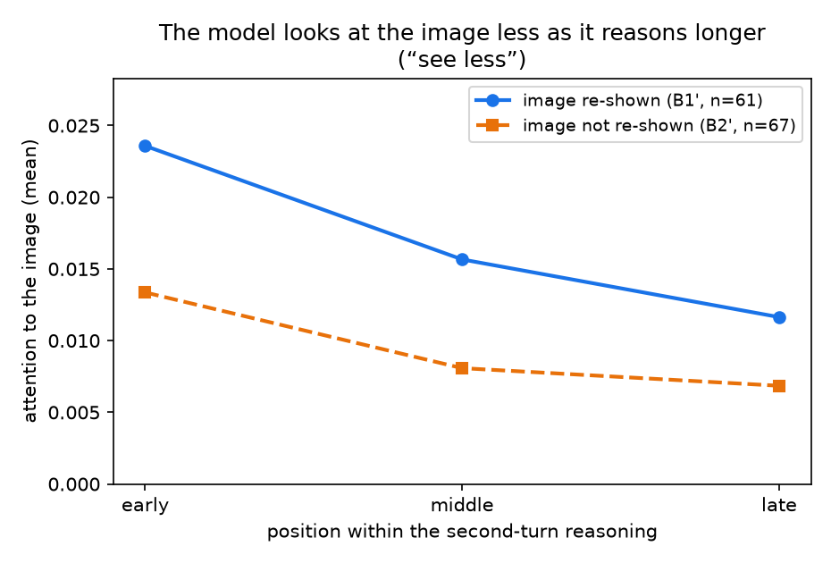
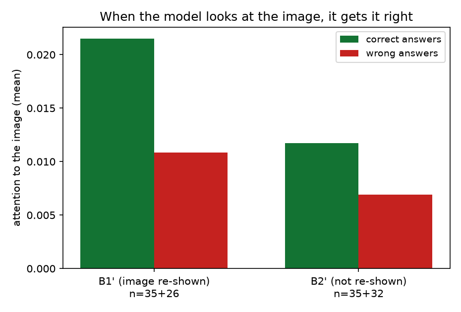

# BabyVision results

Model: Gemma-4-31B-it. Benchmark: BabyVision, 388 vision-primitive questions
(135 multiple-choice, 253 free-form), 4 task types, 22 subtypes — simple visual puzzles
that young children pass but frontier models fail (mazes, counting, paper-folding, 3D
views, pattern completion).

**The question we are chasing.** When this model gets a visual puzzle wrong, is it because
it reasoned badly, or because it never *saw* the cue in the first place? And if it is a
seeing problem, can we fix it by making the model look again — re-grounding it in the
image? That is the through-line for everything below.

---

## How we ran everything (methods)

**Serving the model.** Gemma-4 runs locally through sglang's raw `/generate` endpoint (not
a chat API), with its thinking channel enabled. Every condition uses identical sampling
settings and the identical question prompt; the *only* thing we change is the reasoning.

**The conditions.** We ran the same 388 questions several ways, along two axes — how long
the model reasons, and whether it gets to look at the image a second time:

| Condition | What changes | Reasoning length (median tokens) |
|-----------|--------------|----------------------------------|
| A0 | answer directly, no thinking | 536 |
| standard | normal thinking (run 3×) | 7,334 |
| A3 | forced to think much longer | 12,599 |
| B2 | second turn to reconsider, image **not** shown again | 9,308 |
| B1 | second turn to reconsider, image **shown again** | 10,105 |
| **B1′ / B2′** | corrected reconsider (see below): the model re-reads **its own first-pass reasoning**, with / without the image | two-turn |

**The two-turn conditions (B family).** The model answers once (turn 1: image + question →
thinking + answer), then gets a second turn to reconsider. B1 re-shows the image in turn 2,
B2 does not.

**A bug we found and fixed.** We intended turn 2 to say "here is your earlier reasoning,
re-examine it." But Gemma-4's chat template **silently strips the thinking out of past
assistant turns and keeps only the final answer**. We caught this by rebuilding the exact
turn-2 prompt the model received and confirming the turn-1 reasoning was missing (verified
on all 763 two-turn items). So the original B1/B2 actually tested "reconsider from your
*answer* (+ fresh image)", not "reconsider with your *reasoning*." We fixed it by folding
the turn-1 reasoning into the turn-2 **user** message (which is not stripped) and re-ran as
**B1′ / B2′**. We then verified prompt-by-prompt on all 388 items that the reasoning now
reaches the model and (for B1′) the image is genuinely re-injected.

**Scoring.** A Qwen3-32B judge reads the model's full final answer and decides if it matches
the correct answer *in substance* — no rigid format matching (Gemma sometimes writes the
answer outside the `\boxed{}`, which a regex would miss). On multiple-choice items, where we
know the gold letter, we check the judge against ground truth and it agrees 96–100% of the
time. For two-turn answers that ran out of room while still thinking and never produced a
real second answer, we fairly fall back to the model's first-turn answer.

**Significance.** All condition comparisons use **paired** tests on the same items
(McNemar, exact binomial), plus bootstrap confidence intervals. We compare against standard
run three times (majority vote) so we are not fooled by a single lucky run.

**Attention.** To see *where* the model looks, we re-feed each answered item through the
model with teacher-forcing and read out the attention weights (this needs the slower "eager"
attention; the fast kernels don't expose weights). We reconstruct the exact two-turn prompt
and **append the model's own generated turn-2 text** so its reasoning is really present
(again sidestepping the template strip), then measure how much of the attention from the
turn-2 reasoning tokens points back at the image tokens. Caveat, stated up front: holding
the full attention matrix in memory is expensive, so we could only process the **shorter
items (about 16% of the set, 60–66 questions)** — the attention numbers are a *preliminary,
correlational* look, not the final word.

---

## Finding 1: changing the reasoning barely moves accuracy

| Condition | Accuracy | vs standard | Significant? |
|-----------|----------|-------------|--------------|
| A0 | 29.4% | −1.0 | no (p=0.76) |
| standard | 31.6% (±1.4) | — | — |
| A3 | 30.7% | +0.3 | no (p=1.00) |
| B2 | 28.1% | −2.3 | no (p=0.41) |
| B1 | 33.2% | +2.8 | no (p=0.29) |

Accuracy barely moves. None of the differences are statistically real — and standard run
three times already swung 3.1 points on its own (30.4 / 33.5 / 30.9), bigger than most
gaps between conditions.

The one result that looked promising — re-showing the image (B1) beating no-reshow (B2) by
5.2 points — disappeared on a clean look. About 1 in 5 of B1's reconsiderations ran out of
room while still thinking (they fell into repetitive loops) and never produced a real second
answer; for those we fell back to the first answer. On the clean subset where both produced
a genuine second answer, the gap shrank to +2.1 points (p = 0.55). The apparent win was an
artifact, not re-grounding helping.

## Finding 2: whether the model is right is decided by the question, not the reasoning

Treating the 7 runs per item (A0, standard×3, A3, B1, B2) as 7 attempts at the same question:

| Across all 7 attempts | Items | Share |
|-----------------------|-------|-------|
| always right | 27 | 7% |
| always wrong | 135 | 35% |
| sometimes right, sometimes wrong | 226 | 58% |

Take any two conditions and go item by item: they land the same way (both right or both
wrong) on 72–77% of items. Two unrelated conditions would still match ~58% of the time by
luck (mostly by both being wrong). So the item itself largely decides the outcome; switching
the reasoning barely changes which items are right.

Same point another way: changing the reasoning regime flips an item right↔wrong 25.5% of the
time — but just re-running standard with a new random seed flips it 25.3% of the time, the
same rate. Reasoning re-samples the answer around a fixed perception; it doesn't steer it
toward the right one.

## Finding 3: the hard tasks are the ones that need step-by-step looking

The 135 always-wrong items are not spread evenly. Sorting subtypes by how often the model
gets them right, the tasks that almost never get solved are the ones needing **serial,
step-by-step inspection** (tracing a path, counting, matching elements one by one); the ones
solved more often are **single-glance** recognitions.

| Group | n subtypes | Mean % correct | Ever solved |
|-------|------------|----------------|-------------|
| Serial / step-by-step | 11 | 18.8% | only 12% of these items ever |
| Single-glance | 11 | 43.4% | — |

This is real (p ≈ 0) but not the whole story: the separation is moderate, and about a third
of single-glance items also fail. Honest version: needing step-by-step looking almost
guarantees failure, but not needing it does not guarantee success.

## Finding 4: on the unsure items, the model is an uncalibrated coin-flip

For the 226 "sometimes right" items we asked what tips one attempt from wrong to right,
holding the item fixed:

| Signal (right vs wrong attempts of the *same* item) | Predicts the flip? |
|-----------------------------------------------------|--------------------|
| Confidence (answer entropy, token log-probability) | No — equally confident when wrong as when right |
| Length (tokens spent) | No — only a weak, non-significant hint |
| Which wrong answer it picked (MCQ) | No — wrong answers scatter across the options |

On an unsure item, whether an attempt lands right or wrong is not predictable from its
length, confidence, or answer. Each attempt is a coin-flip at the item's own success rate,
and the model has no internal sense of which way it went.

---

## Finding 5: re-examining *with your own reasoning* helps perception, hurts reasoning

This is the corrected re-grounding experiment (B1′/B2′) — the model genuinely re-reads its
first-pass reasoning in turn 2 and is told to check each observation against the image.

**Overall, it's a wash.** Against the fair baseline (standard, majority of 3 runs = 27.8%),
B1′ lands at 27.8% — dead even, with exactly 42 items flipping each way. (It looks *worse*
only if you compare to standard's single luckiest run of 30.7%.)

**But the overall tie hides a clean split by task type:**

| Task family | standard | B1′ (re-grounding + own reasoning) | change | significant? |
|-------------|----------|------------------------------------|--------|--------------|
| perception (counting, search, tracing) | 15.7% | **22.5%** | **+6.8** | **yes (p = 0.015)** |
| reasoning (rotation, folding, overlay, completion) | 39.6% | 33.0% | −6.6 | no (p = 0.12, a trend) |

Re-examining with your own reasoning **significantly helps the perception tasks** (+6.8
points; 19 items flip wrong→right vs only 6 the other way) and **hurts the reasoning tasks**
as a trend (−6.6, not significant on its own; though individual subtypes like Rotation −30
and Overlay −29 drop hard). To be precise: only the perception gain is statistically solid;
the reasoning drop is a consistent direction, not a proven effect.

**The driver is the reasoning, not the image.** B2′ (same thing but the image is *not*
re-shown) gives the same split — perception +5.2, reasoning −7.6. And comparing B1′ vs B2′
directly, where the *only* difference is whether the image is shown again, only 9 of 388
items change and there is no real difference. So re-displaying the image does almost nothing;
the effect comes from putting the model's own reasoning back in front of it.

**Why this makes sense.** When the answer is *in the image* (perception), being handed your
earlier reasoning as a checklist — "you said 5 clusters; look again and check" — sends the
model back to re-count and catch its mistakes, so it helps. When the answer comes from a
*mental operation* the image can't show (rotate this shape, fold this paper), re-reading your
earlier reasoning just makes you re-commit to the same — possibly wrong — mental step, so it
doesn't help and tends to hurt. (One caveat: B1′ also changed the turn-2 wording vs the old
B1, so it isn't a perfectly clean one-variable swap; and the per-subtype counts are small, so
we lean on the family totals.)

## Finding 6: where the model looks — it stops looking, and that's when it fails

A first, preliminary look at the attention (shorter items only, ~16% of the set,
correlational — see methods). Three things line up with everything above.

**It looks at the image less the longer it reasons ("see less").** Across the second-turn
reasoning, attention to the image drops by about half from start to finish (B1′ −51%, B2′
−49%).

**When it keeps looking, it's right.** Correct answers put about **twice** as much attention
on the image as wrong answers (B1′: 0.022 vs 0.011; B2′: 0.012 vs 0.007). Looking and being
right go together; disengaging and being wrong go together. (Correlational — easier items may
both draw more looking and be answered right — but the signal is clean and consistent.)

**Reasoning tasks disengage from the image; perception tasks keep checking it.** Reasoning
tasks start with high image attention and then drop steeply (−60%) — the model reads the
configuration, then turns inward to its mental operation. Perception tasks hold lower but
*steadier* attention (−38%) — they keep glancing back. This is exactly the split from
Finding 5: the tasks that keep looking are the ones that re-examination helps.

**It barely uses the re-shown image.** When the image is re-injected (B1′), in 49 of 60 items
the model still attends *more* to the original copy than the fresh one — it leans on what it
already encoded rather than the new look. That is the mechanism behind "re-showing the image
does almost nothing" in Finding 5.

---

## What this all tells us

The model's answer to these puzzles is gated by **perception**, set when it first looks at
the image. Extra thinking, forced length, and reconsidering mostly re-sample the answer
around that fixed perception rather than fixing it (Findings 1–2), and the tasks it cannot do
are the ones needing attention moved step-by-step across the image (Finding 3). The attention
backs this up directly: the model looks at the image less as it reasons, and when it stops
looking it gets the answer wrong (Finding 6).

**On re-grounding — the answer is a qualified yes.** Making the model re-examine *with its own
reasoning* genuinely and significantly helps the **perception** tasks (+6.8), because there
the cue is in the image and a second, guided look can recover it. It does *not* help the
reasoning tasks, where the missing step isn't visual. And crucially, simply **re-showing the
image is not enough** — the model doesn't really look at the fresh copy; what helps is being
prompted to re-check its own observations against the picture.

So: responses that are poorly grounded in perception are weak (correct answers literally look
at the image more), and re-grounding *can* help — but only for genuinely perceptual tasks, and
only when the model is actively pushed to re-examine, not just shown the image again. The
natural next step is to make that second look stronger and more targeted, and to confirm the
attention story on the long items we couldn't yet fit in memory.

---

## Reproducibility

Inference: `run_infer.py`, `run_infer_a3.py`, `run_infer_b.py` (two-turn; `--fold-reasoning`
is the corrected B1′/B2′). Scoring: `grade.py`. Significance: `babyvision_validity.py`,
`babyvision_mcnemar_b.py` (within-family). Condition analysis: `analyze_conditions.py`.
Item structure: `babyvision_flips.py`, `babyvision_churn.py`, `babyvision_serial.py`,
`babyvision_transitions.py`. Prompt-strip verification: `verify_b1cot.py`. Attention:
`extract_attention_b.py`, `babyvision_attn_analyze.py`. Figures: `babyvision_report_plots.py`.

## Appendix: per-subtype solvability

Mean % correct over all 7 attempts, hardest to easiest. "Group" marks serial (S) vs
single-glance (H). It is a smooth gradient, not two clean clusters.

| Subtype | Group | n | Mean % correct |
|---------|-------|---|----------------|
| Find the same | S | 17 | 7.6 |
| Maze | S | 20 | 8.6 |
| Count 3D blocks | S | 22 | 11.0 |
| Lines Observation | S | 9 | 11.1 |
| Connect the lines | S | 19 | 11.3 |
| Metro map | S | 12 | 17.9 |
| Paper Folding | S | 12 | 19.0 |
| Find the different | S | 16 | 22.3 |
| Find the shadow | S | 23 | 23.0 |
| 3D Cube Unfold | S | 12 | 25.0 |
| Mirroring Patterns | H | 10 | 27.1 |
| Pattern and Color Completion | H | 20 | 30.7 |
| Count Same Patterns | S | 35 | 34.7 |
| Logic Patterns | H | 14 | 41.8 |
| 3D Pattern Completion | H | 18 | 42.1 |
| 2D Pattern Completion | H | 20 | 42.1 |
| 3D Views | H | 27 | 44.4 |
| Reconstruction | H | 14 | 44.9 |
| Count Clusters | H | 18 | 45.2 |
| Overlay Patterns | H | 17 | 48.7 |
| Recognize numbers and letters | H | 23 | 51.6 |
| Rotation Patterns | H | 10 | 55.7 |
