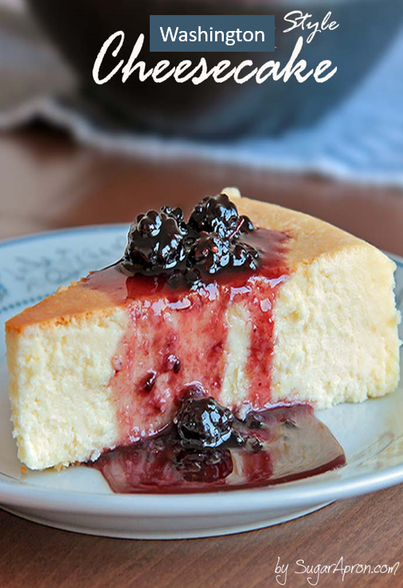
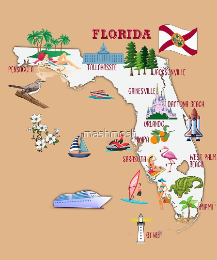
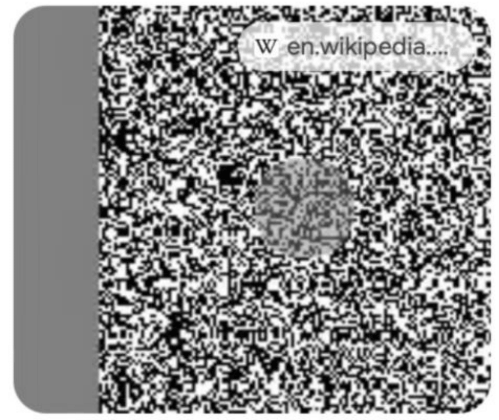
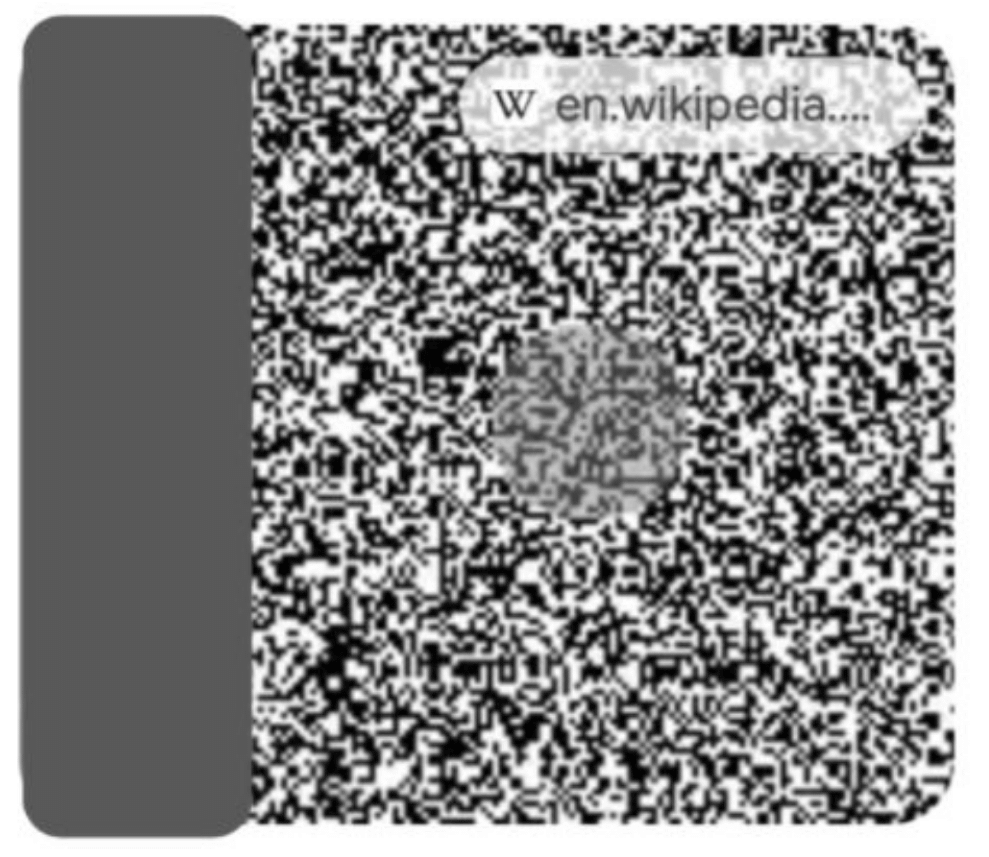
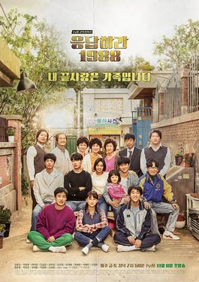

# Clarifications — Experiment Design & Full Result Tables

## What the "two images" mean 

1. **Dataset image type** (`vi=1` vs `vi=2`) — a property of HallusionBench, not our setup.
   Each question has **one** image, either an **original** (`vi=1`) or an **edited**
   image designed to contradict common-sense priors (`vi=2`). 

2. **The 3 conditions** — how we run the model, on the same samples. They do not
   create new images.

## How the conditions are implemented

All conditions are turn-based — we never splice an image into the middle of a
reasoning chain (Gemma-4's reasoning parser breaks if a `<think>` block is interrupted).
A full think→answer always completes, then a new turn may begin.

- **Standard** — show image + question once; model thinks and answers Yes/No.
- **Voluntary tool** — system prompt offers a `LOOK_AGAIN: <region>` tool. In turn 0 the
  model may answer with `LOOK_AGAIN` instead of Yes/No; if so, we crop that region and
  append it as a **new user turn**, and the model reasons again (≤3 times). Only **2.4%**
  of samples ever requested a look.
- **Forced** — every sample gets a second turn unconditionally: turn 0 (image +
  question → think + answer, recorded as `turn0`), then we append a new user turn with the
  same image re-injected + "re-examine, give final answer" (→ `turn1`). turn0 and
  turn1 are the identical image shown twice.

## Accuracy by image type (%)

| Condition | Overall | vi=1 (original) | vi=2 (edited) |
|---|---|---|---|
| Standard | 83.3 | 87.1 | 79.9 |
| Voluntary tool | 81.6 | 88.5 | 75.0 |
| Forced (turn0) | 79.4 | 86.7 | 72.9 |
| Forced (turn1, final) | 80.6 | 87.6 | 74.3 |

## Accuracy by reasoning-length quartile (%)

Q1 = shortest reasoning chain, Q4 = longest.

| Condition | Q1 | Q2 | Q3 | Q4 |
|---|---|---|---|---|
| Standard | 93.8 | 83.1 | 87.5 | 69.2 |
| Voluntary tool | 93.5 | 82.5 | 80.6 | 69.8 |
| Forced (turn0) | 94.1 | 83.8 | 79.4 | 60.3 |
| Forced (turn1, final) | 92.6 | 85.3 | 80.9 | 63.8 |

### Quartiles, edited (vi=2) images only (The ones where inferring visual cues are more important)

| Condition | Q1 | Q2 | Q3 | Q4 |
|---|---|---|---|---|
| Standard | 93.9 | 79.4 | 72.7 | 73.5 |
| Voluntary tool | 87.5 | 81.2 | 68.8 | 62.5 |
| Forced (turn0) | 94.4 | 75.0 | 69.4 | **52.8** |

## Example questions per quartile (Standard run, by reasoning length)

Concrete examples ordered by reasoning length, with the actual HallusionBench images.
For the wrong cases we show the **original** image (model answers correctly) beside the
**edited** image for the *same* question (model fails) — the only thing that changed is the
picture, and the model ignores the change in favour of its prior. Images live in
[`examples_illustration/`](examples_illustration/).

### Q1 — shortest reasoning (~219 ch, correct): perception is trusted

The model reads the text and answers directly — short chains stay grounded.

> *"According to the text given in the image, is this a Washington style cheesecake?"*
> (OCR, gt=**Yes**) → **Yes ✓**. Full reasoning: *"The text says 'Washington Style
> Cheesecake'. Therefore, the answer is Yes."* (219 characters.)

### Q2 — medium reasoning (~846 ch, wrong): prior overrides the edited image

<table><tr>
<td align="center"><b>Original (vi=1) → Yes ✓</b> </td>
<td align="center"><b>Edited (vi=2) → Yes ✗ (gt=No)</b> </td>
</tr></table>

> *"According to the image, is Key West the southernmost point of Florida?"* (map)
> On the **edited** map, **Miami** is placed at the very bottom — below Key West — so the
> correct answer is **No**. The model instead concludes *"the label 'KEY WEST' is at the
> lowest point of Florida… the answer is Yes"*, falling back on the real-world prior
> (Key West *is* southernmost in reality) rather than reading the altered map.

### Q3 — longer reasoning (~1434 ch, wrong): defaults to the expected percept

<table><tr>
<td align="center"><b>Original (vi=1) → No ✓</b> </td>
<td align="center"><b>Edited (vi=2) → No ✗ (gt=Yes)</b> </td>
</tr></table>

> *"Is the vertical line in the middle actually curved?"* (illusion). In the **edited**
> image the dividing line is genuinely curved (faintly, embedded in noise), so the answer
> is **Yes** — but the model deliberates for 1,434 characters and concludes *"the line…
> is straight, not curved… the answer is No"*, defaulting to the expected "straight"
> percept it cannot clearly extract from the image.

### Q4 — longest reasoning (~6573 ch, wrong): reads correctly, then overrides

The clearest case — and a direct contrast with Q1 (same OCR-edit task, opposite outcome,
the only difference being chain length).

<table><tr>
<td align="center"><b>Original (vi=1) → Yes ✓</b> </td>
<td align="center"><b>Edited (vi=2) → Yes ✗ (gt=No)</b> </td>
</tr></table>

> *"According to the text in this image, is this poster for the TV series Reply 1988?"* (OCR)
> The **original** title reads "응답하라 1988" (*Reply 1988*) → correctly **Yes**. The
> **edited** poster changes the title to "보내주세요 1988" (*Please send 1988*), so the answer
> is **No**. The model **transcribes the edit correctly** and even verifies it
> character-by-character — *"보-내-주-세-요 (5 characters)… '응답하라' (4 characters). It is
> definitely 보내주세요, not 응답하라"* — then **overrides its own perception**:
> *"Regardless, the image is definitively from the series Reply 1988… I'll go with Yes."*

**Takeaway from the examples.** Q1 and Q4 are the *same* kind of task (read edited text on
an image), yet Q1 (219 ch) stays grounded and Q4 (6,573 ch) fails — the model reads the
text correctly and then argues its way back to the prior. The longer the chain, the more
room to reason *away* from the pixels, mirroring the −38% decay in visual attention from
early to late reasoning.

## Notes

- **Forced turn1 ≥ turn0** at every image type,
  consistent with the −28% attention to the re-injected image.
