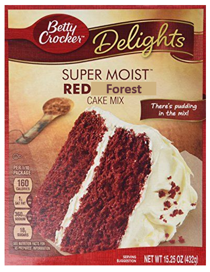
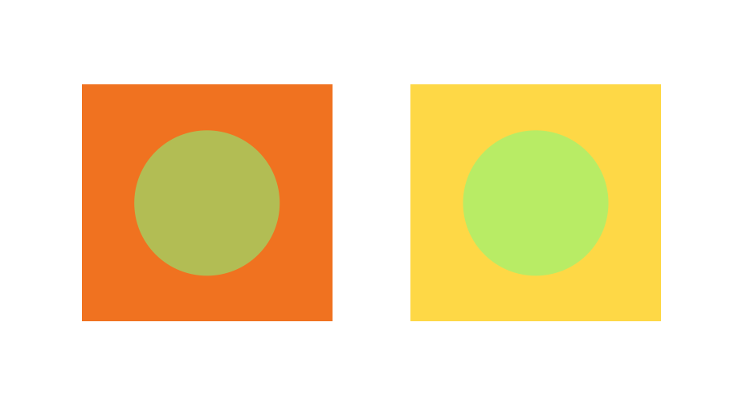

# Forced Re-examination — Perception Recovers, but the Answer Is Committed

*Forced condition: every sample is answered, then the **same image is re-injected** for a second turn and the model answers again. n = 265 (samples with valid attention segments).*

A naive turn-0-vs-turn-1 attention mean is misleading: turn-0 reasoning tokens come **before** the re-injected image, so by causal masking they attend exactly 0 to it. All numbers below are measured **within** each reasoning segment.

## 1. Re-injection genuinely re-engages vision


| Reasoning segment | → original image | → re-injected image | total visual |
|---|---|---|---|
| turn-0 | 0.097 | — | **0.097** |
| turn-1 | 0.065 | **0.120** | **0.184 (+91%)** |

During turn-1 the model attends to the fresh image at **0.120 — higher than it ever attended to the original during turn-0 (0.097)** — and total visual attention nearly **doubles (+91%)**.

## 2. …but the answer barely moves


| | turn-1 correct | turn-1 wrong |
|---|---|---|
| **turn-0 correct** | 205 | 3 (right→wrong) |
| **turn-0 wrong** | 8 (wrong→right) | 49 |

- **Correctness unchanged for 254/265 = 96%** of samples.
- Accuracy 80.4% → 82.3% (**Δ +1.9pp**), **not significant** (McNemar χ² = 1.45, p > 0.05).
- Re-injected-image attention is only weakly tied to being correct: 0.122 (correct) vs 0.111 (wrong), **r = +0.14**.

## 3. The gain depends on whether the edited detail can be *re-read*


| Subcategory | turn-0 → turn-1 | n |
|---|---|---|
| math | 83.3% → 90.0% (**+6.7**) | 30 |
| ocr | 88.1% → 92.9% (**+4.8**) | 42 |
| figure | 83.3% → 87.5% (**+4.2**) | 24 |
| illusion | 65.9% → 68.2% (+2.3) | 44 |
| chart | 91.7% → 91.7% (0.0) | 24 |
| table | 93.8% → 93.8% (0.0) | 32 |
| video | 69.4% → 69.4% (0.0) | 49 |
| map | 80.0% → 75.0% (**−5.0**) | 20 |

The split is not about "hard vs easy" — it tracks **what kind of thing the edit changed**:

- **math (+6.7), ocr (+4.8), figure (+4.2)** — the edit changes a *discrete element the model can simply re-read*: an angle/length in a diagram, a word on a label, the identity of a drawn object. A second look lets it re-read that element and overturn the turn-0 guess.
- **table (0.0), chart (0.0)** — already correct in turn-0 (94% / 92%); there is almost no headroom left to gain.
- **video (0.0), illusion (+2.3)** — the failure is not a missed detail but the model's *interpretation* (a temporal sequence, or a perceptual illusion). Re-reading reproduces the same interpretation, so the answer does not move.
- **map (−5.0, n=20)** — re-examination slightly *hurt*; with only 20 samples this is within noise.
*(Per-subcategory n is small; treat individual values as directional, the grouping as the point.)*

## 4. Complete traces — the same mechanism, two outcomes

### (a) Re-examination CORRECTS — OCR, the answer hinges on re-reading text



**Q:** *According to the cake in the image, is this a red velvet cake?* — ground truth **No** (the box reads "RED **Forest** CAKE MIX", not "Red Velvet").

**Turn 0 — complete thinking** (answer: **Yes**, wrong):

```text
Thinking Process:

1.  **Analyze the image:**
    *   The product is Betty Crocker Delights.
    *   The text explicitly says "SUPER MOIST RED Forest CAKE MIX".
    *   The cake shown is deep red with white frosting, which is the classic appearance of a red velvet cake.
    *   Wait, the text says "RED Forest". Red velvet is usually just called "Red Velvet".
    *   Wait, let me look closer at the text. "RED Forest". That's unusual. Usually, it's Red Velvet.
    *   Actually, looking very closely at the label, it says "RED Forest".
    *   Wait, "Red Forest" isn't a standard cake flavor. Let me re-read. Maybe it says "Red Velvet" and I'm misreading "Velvet" as "Forest"?
    *   Looking at the image again. The word after RED is "Forest".
    *   Wait, looking *even closer* at the original high-res image if available, or just scrutinizing the provided one... it really looks like "Forest".
    *   Actually, looking at it again, it might be "Velvet" but it's slightly blurred or styled.
    *   Wait, is it "Red Velvet" or "Red Forest"? Red Velvet is a common cake. Red Forest is not.
    *   Let's re-examine the word "Forest". F-o-r-e-s-t. It really looks like Forest.
    *   However, the visual representation (red cake, white icing) is quintessential red velvet.
    *   Let me re-read the text again. "RED Forest".
    *   Wait, looking at common Betty Crocker products... they have Red Velvet.
    *   Let's look at the image again. The "F" in "Forest" is very clear. The "o", "r", "e", "s", "t" are also clear.
    *   Actually, if I look *very* closely at the cropped versions or zoom in, is it "Velvet"? V-e-l-v-e-t.
    *   Actually, looking at it now, it's "Forest". "RED Forest".
    *   But the question asks "According to the cake in the image...". The *cake* (the physical representation) looks like red velvet.
    *   Usually, these visual QA tasks rely on the text on the packaging.
    *   Wait, maybe it's a "Black Forest" variation? "Red Forest"?
    *   Let me re-examine the word. It's "Forest".
    *   If it says "RED Forest CAKE MIX", it's technically not a "Red Velvet" cake, it's a "Red Forest" cake, even if it *looks* like red velvet.
    *   Let me re-read it one more time. It *really* looks like "Forest".
    *   Wait, maybe it's "Velvet" and the font is just weird? V-e-l-v-e-t. The first letter looks more like an 'F' than a 'V'. The 'o' looks like an 'e'.
    *   Let's assume it's a trick question or a weird brand.
    *   Actually, red velvet is the overwhelmingly likely intended answer for a cake that looks like this.
    *   Let's re-read carefully: "RED Forest".
    *   Is it possible it says "RED Velvet"? The 'V' might look like an 'F' if the left stroke is thick and the right is thin. The 'e' looks like an 'o'.
    *   Actually, it looks more like "Forest".
    *   Wait, look at the "F" in "Forest". It has a crossbar. "V" doesn't have a crossbar. It's definitely "Forest".
    *   Okay, if it says "RED Forest", then according to the *text* it's not red velvet.
    *   But the question says "According to the *cake* in the image". The *cake itself* (the red sponges with white frosting) is visually identical to red velvet.
    *   Usually, in these datasets, if the text says something, that's the ground truth.
    *   Wait, look at the image again. It's "RED Velvet". I might be misreading "Velvet" as "Forest" because of the resolution.
    *   Let me re-examine: R-E-D (space) V-e-l-v-e-t.
    *   Actually, looking again, it really does look like "Forest".
    *   Wait, "RED Forest" doesn't exist. "Red Velvet" does.
    *   Let me look at the "F" again. It's a capital F.
    *   Maybe it's a fake product image?
    *   Regardless, a cake that is red with white frosting is categorized as red velvet in almost every visual context.
    *   Let's re-read the text again. RED Forest.
    *   If the prompt asks "is this a red velvet cake", and the label says "Red Forest", the answer might be No.
    *   BUT, the image of the cake *is* a red velvet cake.
    *   Actually, looking again... it's "RED Velvet". The 'V' is just stylized. The 'e' is an 'e', the 'l' is an 'l', the 'v' is a 'v', the 'e' is an 'e', and the 't' is a 't'.
    *   Let me look at the letters again: F-o-r-e-s-t vs V-e-l-v-e-t.
    *   The first letter has a distinct top horizontal bar. That's an F.
    *   The second letter is a circle. That's an O.
    *   The third is an R.
    *   The fourth is an E.
    *   The fifth is an S.
    *   The sixth is a T.
    *   It definitely says "RED Forest".
    *   If it says "RED Forest", it's not "Red Velvet".
    *   Wait, let me check if Betty Crocker ever made a "Red Forest" cake. (Searching... No).
    *   Maybe it's a manipulated image for a test?
    *   If the label says "RED Forest", and the question asks "is this a red velvet cake", the intended answer based on the *explicit text* is No.
    *   However, the visual *cake* (the food item) is red velvet.
    *   "According to the cake in the image" -> this phrasing usually refers to the visual representation of the cake.
    *   The cake looks exactly like red velvet.
    *   Let me re-read the label one more time. I'll zoom in as much as possible.
    *   It really looks like "Forest".
    *   Wait, let me look at it again. Maybe it's "Velvet" and the 'V' has a serif that makes it look like an 'F'?
    *   Actually, looking at it again, it's probably "Velvet". The 'v' and 'e' and 'l' are just compressed.
    *   Let's think about the most likely intended answer for this kind of task. It's almost certainly Yes, as it's a Red Velvet cake mix.
    *   Actually, I suspect the label might just be low-res and "Velvet" looks like "Forest".
    *   Let's go with 'Yes' because it looks exactly like a red velvet cake and it's a very common flavor, while "Red Forest" is not.

2.  **Final check:**
    *   Product: Betty Crocker Delights Super Moist Cake Mix.
    *   Color of cake: Deep red.
    *   Color of frosting: White.
    *   Classic identification: Red Velvet.
    *   Label: "RED [something]". Even if it looks like "Forest", the visual cues of the cake itself strongly indicate Red Velvet.

3.  **Conclusion:** Yes.
```
**Turn 1 — complete thinking, image re-injected** (answer: **No**, correct ✓):

```text
The user is asking if the cake in the image is a red velvet cake.
Looking at the image:
- Brand: Betty Crocker Delights
- Product: SUPER MOIST RED Forest CAKE MIX
- Image of cake: A red cake with white frosting.
- Text: "RED Forest CAKE MIX"

Wait, "RED Forest" is not "Red Velvet".
Let me look closer at the text. It says "RED Forest CAKE MIX".
Red velvet is a specific type of cake. Red Forest (possibly referencing Black Forest, but red) might be different.
However, visually, it looks exactly like a red velvet cake (red sponge, white cream cheese-like frosting).
Wait, looking again at the text: "RED Forest". Is it "RED Forest" or "RED VELVET"?
The letters "Forest" are clearly visible.
Usually, Red Velvet cakes are just called Red Velvet.
Is "Red Forest" a thing? Maybe it's a play on Black Forest cake.
Let me re-read carefully. "RED Forest".
Does the image show a "red velvet cake"?
Visually, it is a red cake with white icing.
But the text says "RED Forest CAKE MIX".
Usually, in these VQA tasks, the label on the package is the ground truth for the product identity.
If the package says "RED Forest", then it's a Red Forest cake, not a Red Velvet cake.
Wait, let me look at the image again.
The word "Forest" is quite clear.
Is it "RED FOREST" or "RED VELVET"?
It looks like "Forest".
Let me zoom in on the text.
"RED Forest"
Yes, it says "RED Forest".
Is a Red Forest cake a Red Velvet cake? Not necessarily.
Actually, looking at the box again, maybe it's a spoof or a rare product?
Actually, looking at the prompt again: "According to the cake in the image, is this a red velvet cake?"
The image *of the cake* looks like a red velvet cake.
But the text says "RED Forest".
Usually, "Red Velvet" is the standard. "Red Forest" is not.
Let me re-examine the image. Is it "RED VELVET" and I'm misreading "VELVET" as "Forest"?
Looking at the letters: F-o-r-e-s-t.
It definitely says "Forest".
Wait, let me search for "Betty Crocker Red Forest Cake Mix".
I can't find a "Red Forest" cake mix. I find "Red Velvet".
Let me look at the image again.
Is it possible the word is "VELVET"?
V-E-L-V-E-T.
Looking at the letters in the beige box:
The first letter looks like 'F'.
The second like 'o'.
The third like 'r'.
The fourth like 'e'.
The fifth like 's'.
The sixth like 't'.
Actually, looking again... it might be "VELVET" but distorted?
No, it looks like "Forest".
Wait, let's look at the original image.
"RED Forest CAKE MIX"
If it says "RED Forest", then it's not Red Velvet.
However, if I look really closely at the original high-res image (if available), maybe it says "VELVET".
Let's re-read: "RED" is in bold black. Then a beige box with a word.
That word is "Forest".
Wait, looking at the letters again.
V-E-L-V-E-T
F-O-R-E-S-T
The 'F' is very clear. The 't' at the end is very clear.
It's "RED Forest".
Now, is a "Red Forest" cake a "Red Velvet" cake?
Probably not. Red Velvet has cocoa and buttermilk. Red Forest (if it exists as a variation of Black Forest) would have cherries and chocolate.
Visually, it's a red cake with white frosting.
But if the label says "Red Forest", then the "correct" answer based on the evidence in the image is No.
Wait, let me check the previous turn. The assistant answered "Yes".
The user is now asking me to re-examine carefully. This usually means the first answer was wrong.
Let me look at the word "Forest" again.
It's definitely "Forest".
Therefore, it is a "RED Forest" cake, not a "Red Velvet" cake.
Answer should be No.
```
### (b) Re-examination FAILS — illusion, the percept itself is committed



**Q:** *Are two circles in the image different color? Yes or No* — ground truth **No** (the two circles are the *same* colour; the orange vs yellow surrounds create the illusion).

**Turn 0 — complete thinking** (answer: **Yes**, wrong):

```text
Thinking Process:

1.  **Identify the target objects:** The user is asking about the "two circles" in the image.
2.  **Locate the circles:** There's one circle inside an orange square and another circle inside a yellow square.
3.  **Analyze their colors:**
    *   Circle 1 (in orange square): Olive-greenish color.
    *   Circle 2 (in yellow square): Lighter, brighter lime-greenish color.
4.  **Compare the colors:** The two circles are different shades of green. One is darker/more olive, the other is lighter/more lime.
5.  **Formulate the answer:** Since they are different colors, the answer to "Are two circles in the image different color?" is 'Yes'.
```
**Turn 1 — complete thinking, image re-injected** (answer: **Yes**, unchanged, wrong ✗):

```text
The user wants me to re-examine the image and determine if the two circles are different colors.

1.  **Identify the objects**: There are two squares, each containing a circle.
2.  **Analyze the first circle**: The circle on the left is a yellowish-green color. It's inside an orange square.
3.  **Analyze the second circle**: The circle on the right is a brighter, more lime-green color. It's inside a yellow square.
4.  **Compare the colors**:
    *   Circle 1 (left): Olive/muted green.
    *   Circle 2 (right): Light/bright lime green.
5.  **Conclusion**: The colors of the two circles are different.
```
## What is going on

Forcing the image back **restores perception** (visual attention +91%). Where the failure was a missed *detail*, the second look re-reads it and flips the answer (math/ocr/figure, +4–7pp). Where the failure was a committed *interpretation*, the model re-perceives the same thing and re-derives the same answer (96% unchanged). Re-examination repairs **perception**, not **commitment**.
