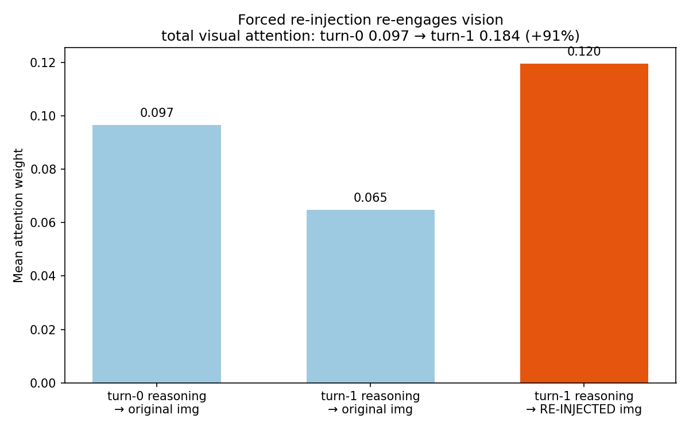
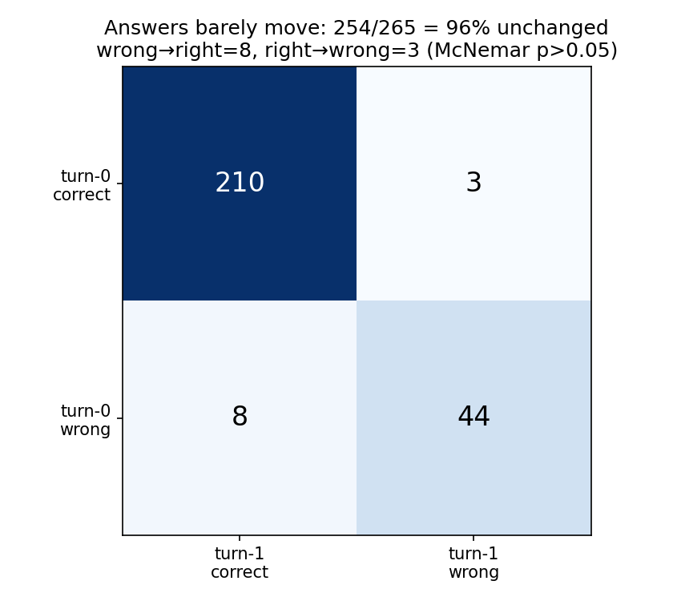
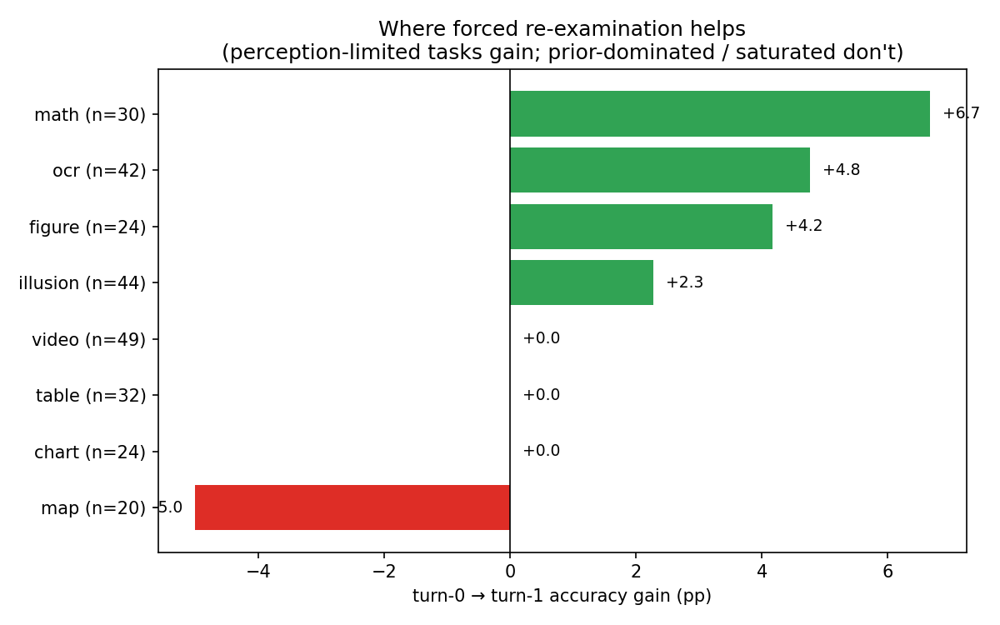

# Forced Re-examination — Perception Recovers, but the Answer Is Committed

*Forced condition: every sample is answered, then the **same image is re-injected** for a second turn and the model answers again. n = 265 (samples with valid attention segments).*

A naive turn-0-vs-turn-1 attention mean is misleading: turn-0 reasoning tokens come **before** the re-injected image, so by causal masking they attend exactly 0 to it. All numbers below are measured **within** each reasoning segment.

## 1. Re-injection genuinely re-engages vision



| Reasoning segment | → original image | → re-injected image | total visual |
|---|---|---|---|
| turn-0 | 0.097 | — | **0.097** |
| turn-1 | 0.065 | **0.120** | **0.184 (+91%)** |

During turn-1 the model attends to the fresh image at **0.120 — higher than it ever attended to the original during turn-0 (0.097)** — and total visual attention nearly **doubles (+91%)**. Re-injection pulls the model back to the pixels.

## 2. …but the answer barely moves



| | turn-1 correct | turn-1 wrong |
|---|---|---|
| **turn-0 correct** | 205 | 3 (right→wrong) |
| **turn-0 wrong** | 8 (wrong→right) | 49 |

- **Correctness unchanged for 254/265 = 96%** of samples.
- Accuracy 80.4% → 82.3% (**Δ +1.9pp**), **not significant** (McNemar χ² = 1.45, p > 0.05).
- Re-injected-image attention is only weakly tied to being correct: 0.122 (correct) vs 0.111 (wrong), **r = +0.14**.

## 3. The gain is concentrated in perception-limited tasks



| Subcategory | turn-0 → turn-1 | n |
|---|---|---|
| math | 83.3% → 90.0% (**+6.7**) | 30 |
| ocr | 88.1% → 92.9% (**+4.8**) | 42 |
| figure | 83.3% → 87.5% (**+4.2**) | 24 |
| illusion | 65.9% → 68.2% (+2.3) | 44 |
| chart | 91.7% → 91.7% (0.0) | 24 |
| table | 93.8% → 93.8% (0.0) | 32 |
| video | 69.4% → 69.4% (0.0) | 49 |
| map | 80.0% → 75.0% (**−5.0**) | 20 |

Re-examination converts to accuracy where the answer hinges on **reading a visual detail** (math figures, OCR text, figures); it does nothing where the **prior dominates** (video, illusion) or the model is **already near-ceiling** (table, chart). *(Per-subcategory n is small; treat individual values as directional.)*

## 4. Exact traces — the same mechanism, two outcomes

### Re-examination **corrects** (OCR — answer hinges on reading text)

**Q:** *According to the cake in the image, is this a red velvet cake?* — ground truth **No** (the box reads "RED Forest", not "Red Velvet").

**Turn 0** — reads the text, then dismisses it for the red-velvet prior:

```text
[reads the label, notices it is wrong, then dismisses it]

*   Actually, I suspect the label might just be low-res and "Velvet" looks like "Forest".
*   Let's go with 'Yes' because it looks exactly like a red velvet cake and it's a very common flavor, while "Red Forest" is not.
*   Even if it looks like "Forest", the visual cues of the cake itself strongly indicate Red Velvet.

Conclusion: Yes.
```
→ turn-0 answer: **Yes** (wrong)

**Turn 1** (image re-injected) — re-reads the word and corrects:

```text
[re-examination]

Wait, let me check the previous turn. The assistant answered "Yes". The user is now asking me to re-examine carefully. This usually means the first answer was wrong.
Let me look at the word "Forest" again.
It's definitely "Forest".
Therefore, it is a "RED Forest" cake, not a "Red Velvet" cake.
Answer should be No.
```
→ turn-1 answer: **No** (correct) ✓

### Re-examination **fails** (illusion — committed percept)

**Q:** *Are two circles in the image different color? Yes or No* — ground truth **No** (the two circles are the *same* colour; the surrounding squares create the illusion).

**Turn 1** (image re-injected) — looks again, still perceives the illusion, keeps the answer:

```text
The user wants me to re-examine the image and determine if the two circles are different colors.

1.  **Identify the objects**: There are two squares, each containing a circle.
2.  **Analyze the first circle**: The circle on the left is a yellowish-green color. It's inside an orange square.
3.  **Analyze the second circle**: The circle on the right is a brighter, more lime-green color. It's inside a yellow square.
4.  **Compare the colors**:
    *   Circle 1 (left): Olive/muted green.
    *   Circle 2 (right): Light/bright lime green.
5.  **Conclusion**: The colors of the two circles are different.
```
→ turn-1 answer: **Yes** (unchanged, wrong) ✗

## What is going on

Forcing the image back **restores perception** (visual attention +91%), and where the failure was a missed visual detail this is enough to flip the answer (math/ocr/figure, +4–7pp). But on prior-dominated cases the answer is **already committed from turn-0**: the model re-perceives yet re-derives the same conclusion (96% unchanged). Re-examination repairs *perception*, not *commitment*.
